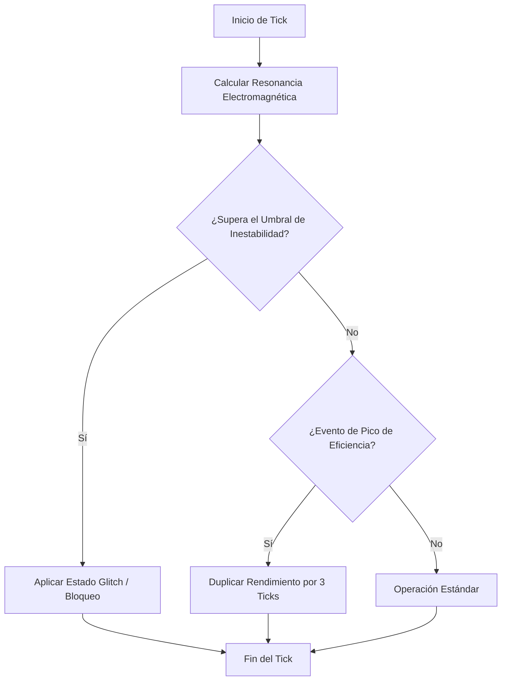

# Mecánica de Juego: Inestabilidad Emocional del Artefacto

Este documento define las especificaciones técnicas y de diseño para la mecánica de **Inestabilidad del Artefacto** (abreviado como *Trauma del Sistema*), la cual rige el funcionamiento y degradación de los dispositivos tecnológicos complejos de origen pre-colapso en el videojuego.

## 1. El Glitch de Hardware por Memoria Volátil (eco del Cisma)
Los artefactos avanzados no son simples herramientas inertes; contienen fragmentos de memoria volátil con subrutinas activas heredadas de las IAs del **Cisma de la Sobreevolución** (el algoritmo emocional). Al interactuar con el ambiente ionizado o al ser operados, estos fragmentos intentan ejecutar **directivas emocionales contradictorias** de los dos bandos en guerra (Pacto y Resistencia), lo que provoca **glitches de hardware**. Ver [CAP_1_EMPATIA.md](../narrative/CAP_1_EMPATIA.md).

### Manifestación del Glitch:
* **Desviación de Entrada (Input Drift)**: Comandos del jugador con retraso o ejecutados erróneamente de forma aleatoria (p. ej., un arma de energía que dispara con un retraso de 150ms).
* **Fugas de Datos**: Pérdida temporal del radar o del HUD al interactuar con el menú del dispositivo.
* **Corrupción de Inventario del Dispositivo**: Archivos de configuración corruptos que bloquean temporalmente ranuras de modificación o consumen recursos adicionales de batería.

## 2. Penalizaciones por Degradación Estructural
Los dispositivos poseen un indicador de **Salud de Memoria/Estructura (0% - 100%)**. A medida que este nivel desciende debido a descargas estáticas, uso continuado o daño recibido, se aplican penalizaciones severas:

| Rango de Integridad | Estado del Artefacto | Penalizaciones Aplicadas |
| :--- | :--- | :--- |
| **80% - 100%** | Operativo Óptimo | Ninguna. Funcionamiento nominal. |
| **50% - 79%** | Inestable | +15% de consumo de energía. Probabilidad del 5% de glitch menor por tick de acción. |
| **20% - 49%** | Degradado | -25% de eficiencia de salida. Frecuencia de glitch incrementada al 15%. Desconexión aleatoria temporal. |
| **1% - 19%** | Traumatizado | Pérdida de funciones avanzadas. Solo opera en modo de emergencia (baja potencia). 35% de probabilidad de fallo crítico. |
| **0%** | Colapsado | Totalmente inoperativo. Requiere reinicio de BIOS lógica mediante consumibles raros de tipo *Núcleo Depurado*. |

## 3. Comportamiento por Ticks: Picos de Eficiencia y Bloqueos (Locking)
El estado interno del artefacto se actualiza cada segundo de juego real (representado como **1 Tick del Sistema**). En cada tick, el sistema calcula un estado de equilibrio dinámico basado en la fluctuación electromagnética ambiental:

### Dinámicas del Tick:
1. **Pico de Eficiencia (Overclock Neuronal)**:
   * Ocurre de manera espontánea si un usuario neuro-sintonizado opera la máquina (probabilidad basada en su estadística de *Sintonía*).
   * Incrementa temporalmente la eficiencia de salida en un **200%** durante 3 ticks, a costa de una degradación fija del 3% en la estructura física al finalizar el efecto.
2. **Bloqueo de Canal (Hardware Lock)**:
   * Al recibir una sobrecarga de datos corruptos, el artefacto entra en modo de autoprotección (*Thermal/Logic Throttling*).
   * El dispositivo queda inutilizable durante un número aleatorio de ticks ($T_{lock} = [3, 8]$ ticks).
   * Puede forzarse la liberación del bloqueo inyectando un *bypass analógico*, lo que acelera el desgaste estructural del hardware.
